<div align="center">



</div>

---

<table width="100%">
<tr>
<td width="100%" valign="top">

### 🧬 About Me

```python
class Sharvesh:
    name       = "Sharvesh Kandavel"
    role       = ["CTO @ Credvan", "Mechatronics Eng @ UWaterloo"]
    location   = "Waterloo, ON 🇨🇦"
    education  = "BASc Mechatronics · Presidential Scholar"

    stack = {
        "languages" : ["Python", "TypeScript", "C++", "SQL"],
        "frontend"  : ["React", "React Native", "Three.js"],
        "backend"   : ["FastAPI", "Convex", "Supabase"],
        "hardware"  : ["Arduino", "MPU-6050", "SolidWorks"],
        "ai_ml"     : ["RAG Pipelines", "LM Studio", "Embeddings"],
        "fintech"   : ["Plaid", "Stripe", "PostgreSQL"],
    }

    currently_building = "Credvan — EWA fintech platform"
    always_learning    = True
    open_to_collab     = True
```

</td>
</tr>
</table>

---
## 🐍 Contribution Snake

<div align="center">

<picture>
  <source media="(prefers-color-scheme: dark)"  srcset="https://raw.githubusercontent.com/SharveshKandavel/SharveshKandavel/output/github-snake-dark.svg"/>
  <source media="(prefers-color-scheme: light)" srcset="https://raw.githubusercontent.com/SharveshKandavel/SharveshKandavel/output/github-snake.svg"/>
  
</picture>

</div>

---

## 🛠️ Tech Stack

<div align="center">

**Languages**


**Frameworks & Libraries**


**Backend & Infra**


**Hardware & Design**


**AI / ML**


</div>

---

## 🚀 Featured Projects

<table width="100%">
<tr>
<td width="50%" valign="top">

### 💰 [BitGold](https://github.com/SharveshKandavel/BitGold)
> *Invest spare change into fractional 24K gold*

```
Stack: React Native · FastAPI · PostgreSQL
       Plaid · Stripe · Supabase
```

- 📱 Cross-platform mobile app (iOS + Android)
- 🔄 Automated round-up detection via **Plaid**
- 🏦 CAD micro-payments via **Stripe PAD**
- 📈 Live gold price retrieval + portfolio tracking
- 🗄️ Normalized PostgreSQL schema with caching


</td>
<td width="50%" valign="top">

### 🖥️ [Revamp AI](https://github.com/SharveshKandavel/Revamp-AI)
> *Full-Stack 3D PC Builder Platform*

```
Stack: React · Three.js · FastAPI
       Supabase · PostgreSQL · TypeScript
```

- 🎮 Interactive **3D PC models** via Three.js / R3F
- 🔧 Hardware Compatibility Engine + PSU calculator
- 👥 Multi-tenant: 3 roles (Customer, Seller, Builder)
- 🔒 Row Level Security (RLS) in PostgreSQL
- 🚀 Live on Vercel with CI/CD via GitHub


</td>
</tr>
<tr>
<td width="50%" valign="top">

### ⚡ [Silambam Motion Sensor](https://github.com/SharveshKandavel/Silambam_Motion_Sensor)
> *Wearable sports analytics for a traditional martial art*

```
Stack: Arduino Nano · C++ · MPU-6050
       HC-06 Bluetooth · IMU Processing
```

- ⚖️ Sub-100g wearable device
- 📡 3-axis motion at **200 Hz** via gyroscope
- 📶 Live Bluetooth stream with **<100ms latency**
- 🎯 Swing scores with ±10% error margin
- 🏆 Contributed to zonal & state-level comp wins


</td>
<td width="50%" valign="top">

### 🤖 [Autonomous Color-Sorting Robot](https://github.com/SharveshKandavel/Autonomous-Color-Sorter)
> *Fully autonomous VEX robot with PID control*

```
Stack: VEX Robotics · C++ · PID Control
       SolidWorks · 4-Sensor Suite
```

- 🎨 Detects color → navigates → deposits autonomously
- 🎯 PID controller: **±1 cm** accuracy over 30 cm range
- 🖨️ 3D-modeled components in **SolidWorks**
- 🔁 Automated real-time error recovery
- 📐 Engineered 3-motor actuation array


</td>
</tr>
</table>

---

## 📈 Contribution Activity

<div align="center">


</div>

---


## 🌐 Connect

<div align="center">

[](https://www.linkedin.com/in/sharvesh-kandavel-b1685032b/)
[](mailto:skandave@uwaterloo.ca)
[](https://github.com/SharveshKandavel)

<br/>


</div>

---

<div align="center">

<!-- START:TIMESTAMP -->
> 🕐 **Last updated:** July 17, 2026 at 09:10 UTC  
> *Auto-refreshed daily by [GitHub Actions](../../actions)*
<!-- END:TIMESTAMP -->


</div>
